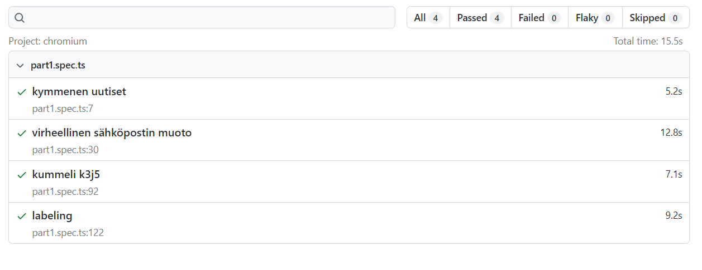
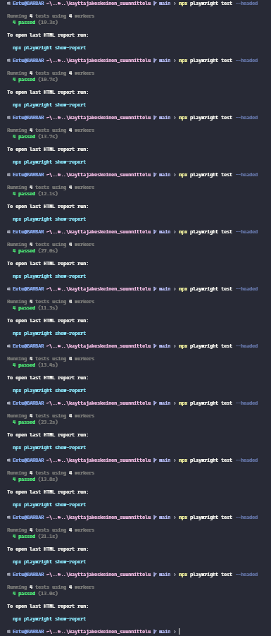
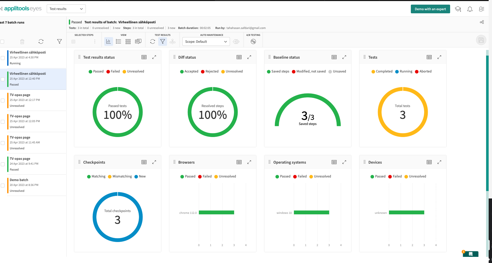
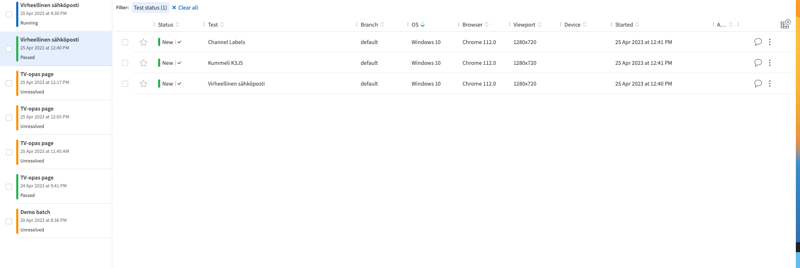

### Part 1

To run the tests, make sure you have Git, Node and NPM installed.
Then run the following commands to setup the project and install dependencies:

```shell
git clone https://github.com/soronen/kayttajakeskeinen_suunnittelu.git
cd kayttajakeskeinen_suunnittelu
npm install
npx playwright install
npm install @axe-core/playwright
npm i -D axe-html-reporter
```

To run the tests and show the html report, run

```shell
npx playwright test --headed
npx playwright show-report
```

The accessibility tests can be found under the folder called 'artifacts'.

### Part 3

To run the tests, make sure you have Git, applitools api key and, Node and NPM installed.
Then run the following commands to setup the project and install dependencies:

```shell
git clone https://github.com/soronen/kayttajakeskeinen_suunnittelu.git
cd kayttajakeskeinen_suunnittelu
npm install
npx playwright install
npm install --save-dev @applitools/eyes-playwright
```

To run the tests :

```shell
npx playwright test --debug part3.spec.ts
or
npx playwright test part3.spec.ts

```

### success





## applitools


