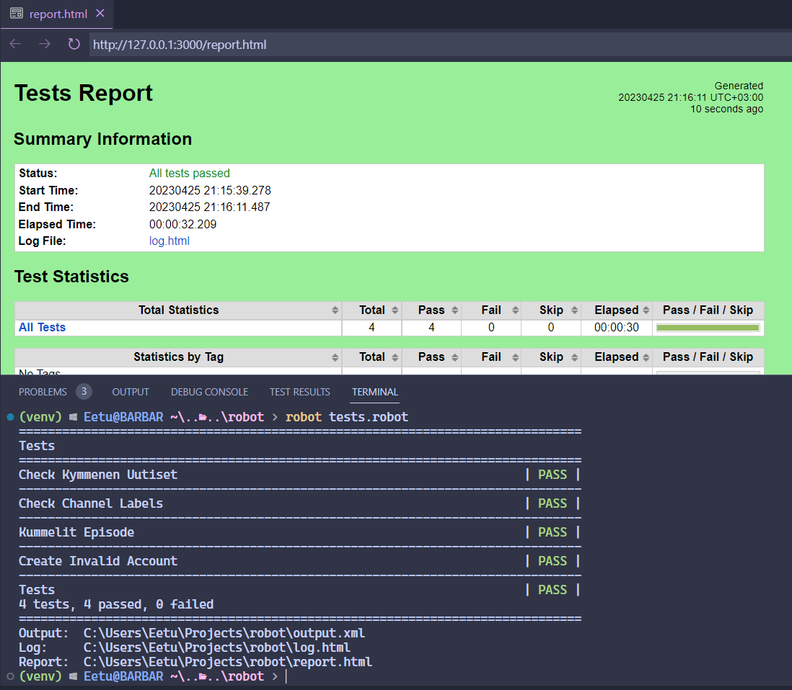

## Yle Areena User Testing With Robot Framework
Uses Browser Library which is powered by Playwright.

### Requirements:
* Python 3 and NodeJS.

To install and initialize Robot Framework & Browser Library, run the following commands:
```bash
pip install robotframework
pip install robotframework-browser
rfbrowser init
```

You can run the tests by typing
```bash
robot tests.robot
```
